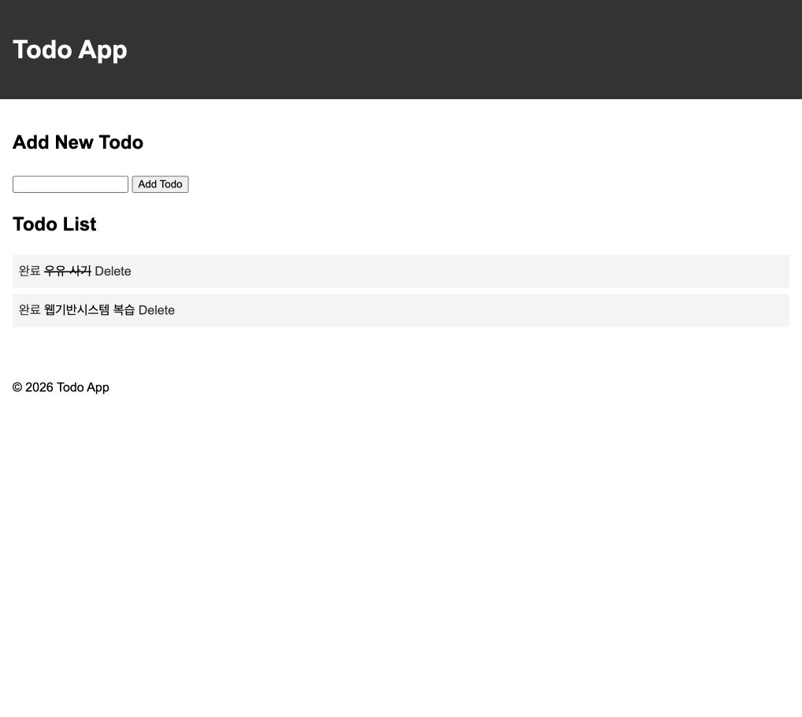

# HW2 Todo 앱 완료 체크

할 일 추가·삭제와 완료 체크 기능을 제공하는 Flask 기반 Todo 앱입니다.

- 이름: 이종석
- 학번: 21011615

## 라우트

| 메서드 | 경로 | 설명 | 템플릿 |
| --- | --- | --- | --- |
| `GET` | `/` | 할 일 목록과 입력 폼 표시 | `index.html` |
| `POST` | `/` | 할 일 추가 후 목록으로 이동 | - |
| `GET` | `/toggle/<int:index>` | 완료·미완료 전환 후 목록으로 이동 | - |
| `GET` | `/delete/<int:index>` | 할 일 삭제 후 목록으로 이동 | - |

## 실행 방법

### 1. 저장소 복제

```bash
git clone https://github.com/Im-Jongseok/flask-practice1.git
cd flask-practice1
```

### 2. 가상환경 생성 및 활성화

```bash
python3 -m venv venv
source venv/bin/activate
```

Windows PowerShell에서는 다음 명령을 사용합니다.

```powershell
venv\Scripts\Activate.ps1
```

### 3. 의존성 설치

`requirements.txt`는 저장소 루트에 있으므로 루트 디렉터리에서 설치합니다.

```bash
pip install -r requirements.txt
```

### 4. HW2 실행

```bash
cd HW2
flask --app app --debug run
```

실행 후 브라우저에서 `http://127.0.0.1:5000/`에 접속합니다.
완료 상태는 새로고침 후에도 유지되며, 서버를 재시작하면 목록이 초기화됩니다.

## 실행 화면

### 할 일 목록


### 완료 체크



### 새로고침 후 완료 상태 유지


